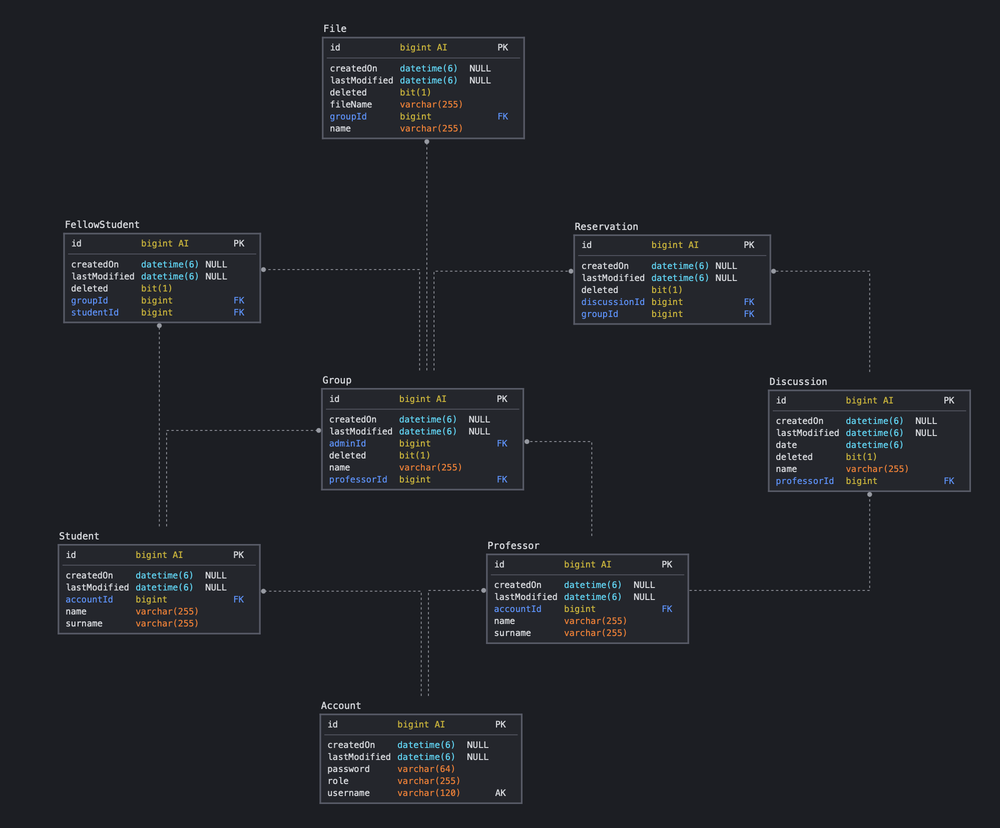

# Project for University

### Documentation

The API documentation is available at the following Swagger link: [API documentation](https://app.swaggerhub.com/apis/mmedici/University/1.0.0)
The project documentation is available at the following link: [Documentation](https://github.com/mmedici0/University/blob/master/documentazione.pdf)

### Requirements

The application requires:
* Database (MySQL)
* Mail server ([Mailtrap](https://mailtrap.io))

### Database (self-generated)

### Configuration

The configuration is available in /src/main/resources/application.properties

The most important configurations are:
* Server Port
  >   server.port
* Database
  >   spring.datasource.url \
  spring.datasource.username \
  spring.datasource.password \
  spring.datasource.driver-class-name
* Encryption key
  >   jwt.secret
* Upload directory
  >   file.upload-dir

### Testing

The tests are available in /src/test/java divided into:

* Controllers:
    * Test public end points
    * Test student end points
    * Test professor end points
* Service:
    * Test public operation
    * Test student operation
    * Test professor operation
